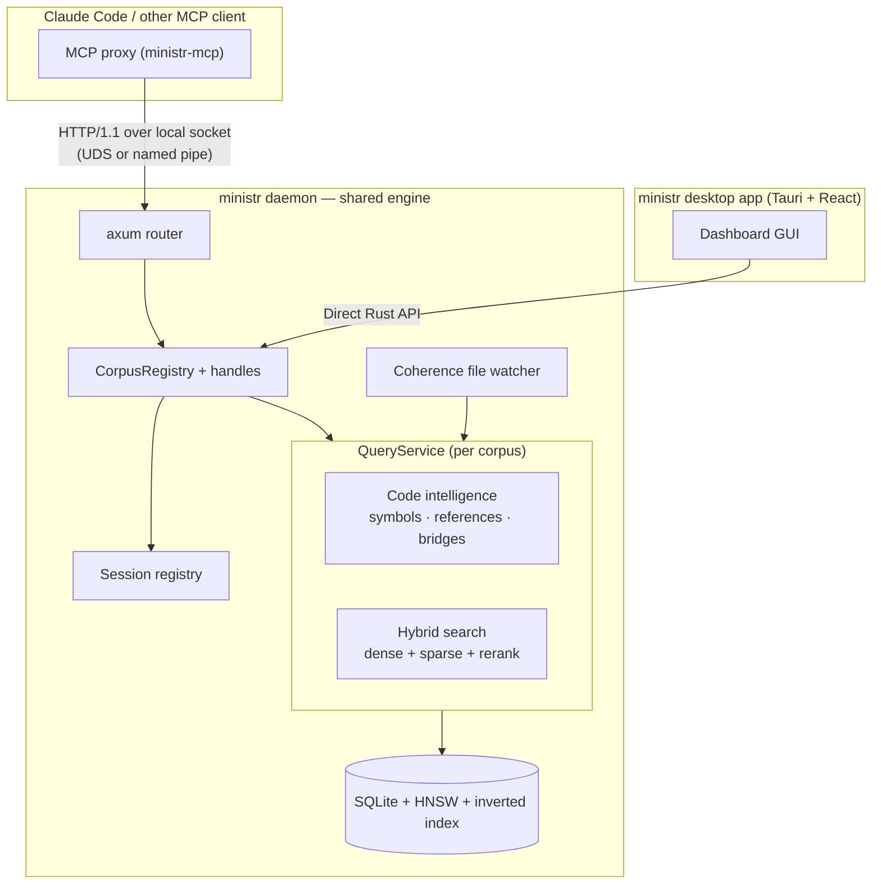

The code-intelligence model — the AST, symbol table, reference graph, bridge links, and vector indexes — is expensive to build and hold in RAM. The daemon exists so it is built **once** and shared: every MCP client and the desktop app query the same engine instead of each loading its own copy of the ONNX model and indexes.

## Topology

The desktop app embeds the daemon crate in-process and shares its `AppState` with Tauri invoke-handlers, so the dashboard calls `CorpusRegistry` directly and skips HTTP. External MCP clients reach the same state through the Axum router over the local socket. Either way they hit one `QueryService` per corpus — one symbol table, one reference graph, one set of indexes.

The channel is the platform's local-socket primitive: a Unix domain socket (`~/.ministr/ministrd.sock`) on macOS and Linux, a named pipe on Windows. It never leaves the machine.

## Component responsibilities

| Component | Crate | Role |
|-----------|-------|------|
| **MCP proxy** | `ministr-mcp` | Thin adapter: translates MCP tool calls into daemon HTTP requests |
| **Daemon** | `ministr-daemon` | Axum server on a local socket: corpus registry, queries, sessions, file watching |
| **Engine** | `ministr-core` | The code-intelligence model: parsing, symbols/refs/bridges, hybrid search |
| **Desktop app** | `ministr-app` | Tauri GUI: project management, dashboard, system tray |
| **API** | `ministr-api` | Shared wire types + `DaemonClient` for local-socket communication |

## Data flow

1. An **MCP client** connects to the proxy over stdio.
2. The **proxy** forwards each tool call to the daemon over the local socket.
3. The **daemon** routes it to the right corpus's `QueryService` — which resolves it against the code-intelligence model and vector store — and records the delivery in the session registry.
4. The **desktop app** shares the same daemon process and reaches the registry through the direct Rust API.
5. The **coherence watcher** detects file changes, triggers incremental re-indexing (re-parse → re-extract symbols/refs → re-embed), and queues staleness alerts so every active session sees fresh results.

Because all clients share one engine, a file edit is re-indexed once and immediately reflected for every connected agent and the dashboard alike.

## Why a proxy instead of a second server

`ministr-mcp` ships two server flavours. `MinistrServer` owns its own storage, embedder, and indexes — fine for a single client. When a second agent connects to a project that already has a primary, starting another full server would load a second ONNX model and a second copy of the indexes into RAM. Instead, the secondary runs as a transparent `ProxyServer`: same MCP tool surface, but every call is forwarded over the socket to the one daemon that already holds the model. One engine, many clients.

## Socket & PID files

- **Socket**: `~/.ministr/ministrd.sock` (Unix domain socket on macOS/Linux; named pipe at the equivalent path on Windows)
- **PID file**: `~/.ministr/ministrd.pid` (stale-socket detection)
- **Data**: `~/.ministr/corpora/<corpus-id>/` (SQLite + HNSW per corpus)
- **Config**: `~/.ministr/config.toml` (global settings)

For what lives inside `content.db` and how queries resolve against it, see the [deep dive](/docs/architecture-deep-dive#what-gets-stored).
