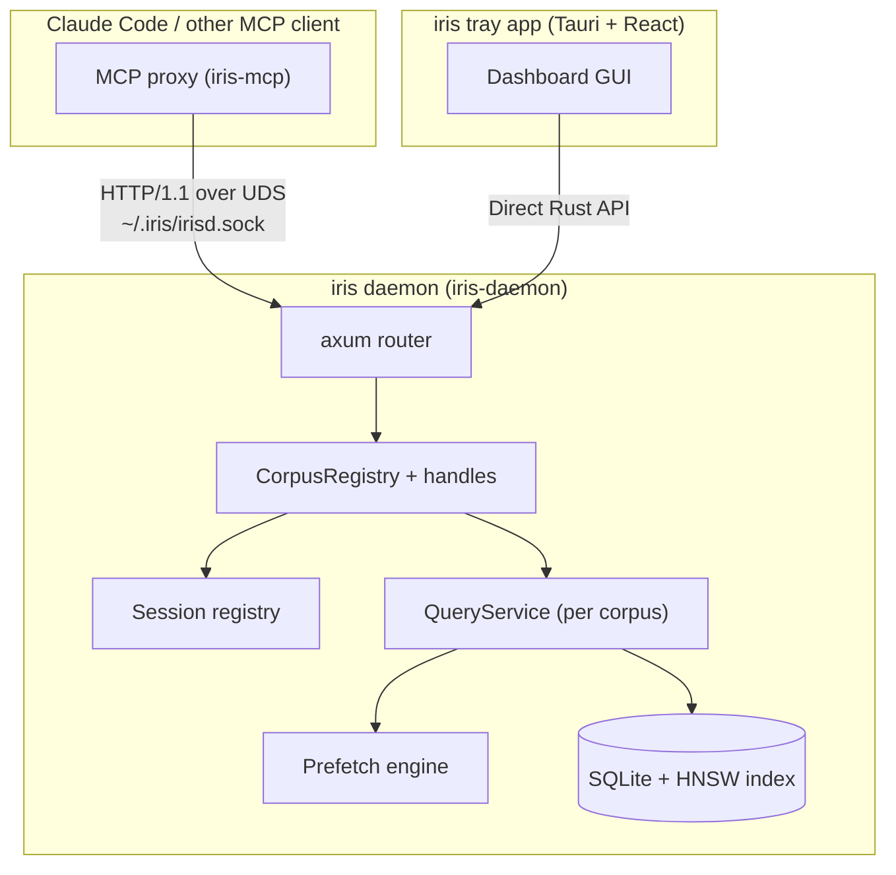

## Topology

## Component Responsibilities

| Component | Crate | Role |
|-----------|-------|------|
| **MCP Proxy** | `iris-mcp` | Thin proxy: translates MCP tool calls to daemon HTTP API |
| **Daemon** | `iris-daemon` | Axum HTTP server on UDS: corpus management, queries, sessions |
| **Tray App** | `iris-app` | Tauri GUI: project management, dashboard, system tray |
| **Core** | `iris-core` | Domain logic: ingestion, search, embeddings, storage |
| **API** | `iris-api` | Shared wire types + `DaemonClient` for UDS communication |

## Data Flow

1. **MCP client** connects to the proxy via stdio
2. **Proxy** delegates tool calls to the daemon over UDS HTTP
3. **Daemon** manages corpora: indexing, querying, sessions, prefetch
4. **Tray app** shares the same daemon process, accesses it via direct Rust API
5. **File watcher** detects changes, triggers re-indexing, broadcasts coherence events

## Socket & PID Files

- **Socket**: `~/.iris/irisd.sock` (Unix domain socket)
- **PID file**: `~/.iris/irisd.pid` (for stale socket detection)
- **Data**: `~/.iris/corpora/<corpus-id>/` (SQLite + HNSW per corpus)
- **Config**: `~/.iris/config.toml` (global settings)
