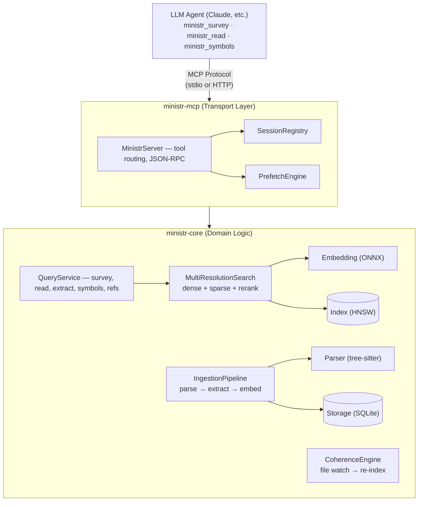
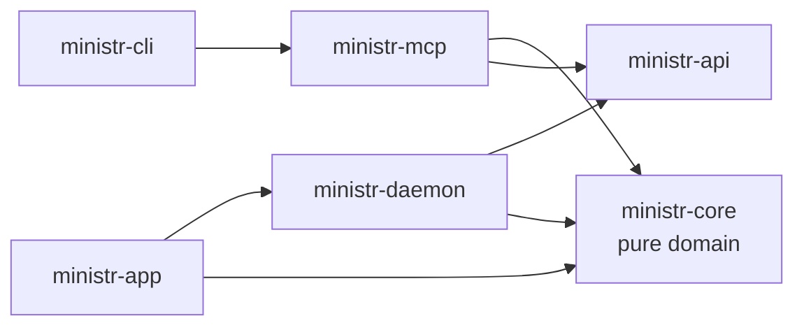

> **ministr** is a Rust-native MCP server that serves context to LLM agents the way
> an L1 cache serves the CPU — with session tracking, predictive prefetching,
> budget awareness, and coherence.
>
> ministr does not (and can't) edit the agent's context window directly. It manages
> *its own output* — what it sends, when, and at what resolution — so the window
> fills with signal instead of redundant reads.

## The Big Picture

Think of ministr as a **smart librarian** that sits between an LLM agent and a codebase. Instead of the agent naively reading files and losing track of what it's already seen, ministr indexes everything, tracks what's been delivered, predicts what's needed next, and shapes its own output — resolution, compression, deduplication — so the agent's finite window stays full of signal instead of redundant re-reads.



## Workspace Structure

```text
ministr/
├── ministr-cli/              ← Binary entry point, CLI commands
│   └── src/
│       ├── main.rs        ← CLI parsing, subcommand dispatch
│       ├── commands/      ← serve, index, init, search, export/import, hooks
│       ├── infra.rs       ← Storage, embedder, index bootstrap
│       ├── ingestion.rs   ← Corpus ingestion orchestration
│       ├── instance.rs    ← Single-instance lock, stdio↔HTTP proxy
│       └── proxy.rs       ← Secondary instance proxy over HTTP
│
├── ministr-mcp/              ← MCP server adapter (depends on ministr-core + rmcp)
│   └── src/
│       ├── server/        ← MinistrServer: tool handlers, session management
│       ├── auth.rs        ← OAuth for cloud deployments
│       ├── proxy.rs       ← Thin proxy that delegates to ministr-daemon
│       └── error.rs       ← MCP-specific error types
│
├── ministr-daemon/           ← HTTP API over Unix domain socket
│   └── src/
│       ├── daemon.rs      ← Axum server, lifecycle management
│       ├── registry.rs    ← CorpusRegistry: manage multiple corpora
│       ├── ask.rs         ← Query handlers
│       ├── inference.rs   ← Embedding service
│       └── state.rs       ← Shared daemon state
│
├── ministr-api/              ← Shared wire types (no ministr-core dependency)
│   └── src/
│       ├── query.rs       ← Request/response types
│       └── client.rs      ← DaemonClient for UDS communication
│
├── ministr-core/             ← Pure domain logic, NO transport dependencies
│   └── src/
│       ├── service/       ← QueryService: the main API facade
│       ├── ingestion/     ← File discovery → parse → embed pipeline
│       ├── coherence.rs   ← File watcher → incremental re-index
│       ├── session/       ← The "cache controller" brain
│       ├── embedding/     ← ONNX + optional Candle Metal GPU
│       ├── index/         ← HNSW + inverted index (SPLADE)
│       ├── storage/       ← SQLite persistence layer
│       ├── parser/        ← Markdown, HTML, PDF parsers
│       ├── code/          ← tree-sitter, symbols, cross-lang bridges
│       └── extraction/    ← Claims, relationships, summaries
│
└── ministr-app/src-tauri/    ← Tauri v2 desktop app with system tray
```

### Dependency Rule



`ministr-core` **never** imports MCP types. `ministr-api` never depends on `ministr-core`. The boundaries are enforced structurally.

## How It Boots Up

When you run `ministr serve`, here's the startup sequence:

```text
main()
  │
  ├─ 1. Parse CLI args (clap)
  │
  ├─ 2. Load config (.ministr.toml + ~/.ministr/config.toml)
  │
  ├─ 3. Try to acquire the `PrimaryLock` for this corpus
  │     ├─ Lock acquired → run as the PRIMARY (real server)
  │     └─ Lock held by another instance → run as a transparent
  │         stdio→HTTP proxy to that primary (`cmd_serve_stdio`)
  │
  ├─ 4. init_infrastructure()
  │     ├─ Open/create SQLite database
  │     ├─ Load embedding backend via `create_embedder` (auto-detects):
  │     │     ├─ macOS + Apple Silicon: Candle on Metal (when the model
  │     │     │    is Candle-supported, e.g. all-MiniLM-L6-v2)
  │     │     ├─ macOS fallback: FastEmbed + CoreML (CPU+GPU compute units)
  │     │     ├─ Windows + `directml` feature: FastEmbed + DirectML
  │     │     ├─ Linux / feature-less Windows: FastEmbed + CPU ONNX
  │     │     └─ Override via MINISTR_BACKEND / MINISTR_DEVICE env vars
  │     └─ Load/create HnswIndex (384-dim, cosine similarity)
  │
  ├─ 5. build_server()
  │     ├─ Create QueryService(storage, embedder, index)
  │     ├─ Create MinistrServer(service, registry, prefetch, ...)
  │     ├─ Enable web fetcher (for ministr_fetch)
  │     ├─ Enable git fetcher (for ministr_clone)
  │     └─ Spawn coherence file watcher
  │
  └─ 6. Start transport
        ├─ stdio: MCP over stdin/stdout (default for Claude Code)
        └─ http: Streamable HTTP MCP server (for cloud)
```

## The Ingestion Pipeline

Before ministr can answer queries, it needs to index the codebase. The pipeline runs in three stages:

- **File discovery** — walk directory, filter by extension, hash for incremental, skip unchanged files.
- **Parse & split** — detect parser (md / html / pdf / code), parse into sections with headings. For code: tree-sitter AST plus extraction of symbols, references, bridges.
- **Embed & store** — embed text to `Vec<f32>`, insert into HNSW index, extract claims, detect relationships, store in SQLite.

### What Gets Stored

ministr's content database lives at `~/.ministr/corpora/<corpus-id>/content.db` and is currently at schema version 19 (`ministr-core/src/storage/schema.rs`). The tables group into six categories:

**Corpus content**
- `documents`, `sections`, `claims` — the structural skeleton of every indexed file
- `claim_relationships` — directed cross-references between claims (references, contradicts, depends_on, updates)
- `file_hashes` — content hash + mtime + extractor version, for incremental re-ingest
- `corpus_roots` — per-root metadata and language stats

**Code intelligence**
- `symbols` — extracted symbols with kind, visibility, signature, doc comment, cyclomatic complexity
- `symbol_refs` — caller→callee, importer→importee, impl→trait edges
- `pending_refs` — deferred reference resolution queue that survives restarts
- `bridge_endpoints`, `bridge_links` — cross-language binding sites and matched export↔import pairs

**Retrieval acceleration**
- `embedding_cache` — content-addressable vector cache, keyed by `(content_hash, model_name)`
- `full_dim_vectors` — un-truncated embeddings for two-stage Matryoshka reranking

**Sessions**
- `sessions`, `session_deliveries` — persistent session state (delivered items, compression tier, cumulative metrics) so that restarts don't drop what the agent already received

**Cross-session learning**
- `section_access_stats`, `co_access_patterns` — access frequency and co-access counts feeding cross-session prefetch
- `section_memory_states` — FSRS stability / difficulty / last-access-turn per section

**External fetches**
- `web_cache` — URL → ETag, Last-Modified, content hash, for `ministr_fetch` / `ministr_refresh`
- `git_cache` — repo URL → branch, commit SHA, clone dir, for `ministr_clone`

**Sub-inference cache**
- `answer_cache`, `answer_cache_sources` — cached `ministr_ask` answers with a reverse index from source section back to queries, so a single section change invalidates only the affected answers

### The Embedding Stack

```text
Text → FastEmbedder (all-MiniLM-L6-v2, ONNX Runtime)
           │
           ├─ Dense vector: 384-dim float32
           │     └─ Stored in HNSW index for ANN search
           │
           └─ SPLADE sparse embedding (default in hybrid retrieval)
                 └─ Stored in inverted index for keyword-aware search

Query time:
  Dense results ─┐
                 ├─ RRF fusion ─→ Candidates ─→ Cross-encoder rerank ─→ Final results
  Sparse results ┘
```

The embeddings are cached in SQLite keyed by content hash — if the text hasn't changed, the embedding is reused without re-running ONNX inference.

## The Query Path

When the agent calls `ministr_survey`, the flow end-to-end is:

1. **MinistrServer** checks the warm prefetch cache.
2. **SessionRegistry** gets or creates the session (keyed by MCP session ID).
3. **QueryService.survey_excluding(query, top_k, delivered_ids)** excludes already-delivered content.
4. **MultiResolutionSearch**: embed → HNSW kNN → optional SPLADE → RRF fusion → optional rerank.
5. **Storage** resolves content IDs to text, returning `Vec<SurveyResult>`.
6. **SessionRegistry** records delivery + budget + analytics.
7. **PrefetchEngine** pre-warms predicted next reads.
8. JSON response + `budget_status` returned to the agent.

### Deduplication

The `survey_excluding` call filters out section IDs that the session has already delivered. This prevents the agent from getting the same content twice.

The real `Session` struct (`ministr-core/src/session/types.rs`) carries quite a bit of state — session ID, budget, eviction policy, turn counter, SessionMetrics, pending coherence alerts, a sliding window of recent queries, and a co-access flush set — but for deduplication the important fields are:

- **`delivered: BTreeMap<String, DeliveredItem>`** — what's been sent, keyed by content ID
- **`trajectory: VecDeque<ContentId>`** — bounded access order (capped so memory doesn't grow unboundedly)
- **`stale: HashSet<String>`** — content IDs invalidated by file changes on disk

## The Session Shadow: ministr's "Cache Controller" Brain

This is the most novel subsystem. It models the agent's context window **from the outside**, predicting what the agent has retained and what's been evicted.

### The Window Estimator

`WindowEstimator` (`ministr-core/src/session/window.rs`) keeps an ordered queue of delivered entries with their token costs and a running total. Each delivery carries a monotonically increasing sequence number so order is preserved across the queue.

When new content is delivered:

1. The entry is pushed onto the back of the queue and its tokens are added to the running total.
2. If the total exceeds the configured capacity (default `100_000`), entries are evicted from the front of the queue until the total fits again.
3. The number of evicted entries is tracked (not the content IDs themselves — a count is enough; what the agent actually still has is the un-evicted queue).

The eviction strategy is set by `EvictionPolicy` — `Fifo` by default, `Fsrs` when the session is run with `BudgetTracker::record_tokens_with_memory` and a companion `MemoryTracker` providing retrievability scores.

### Budget Pressure Levels

The budget tracker maps window utilization to three pressure levels:

- **Normal** (0-80%) — full section text at requested resolution
- **Elevated** (80-95%) — claim-level compression + eviction recommendations
- **Critical** (95-100%) — summaries only, strong eviction recommendations

This is included in **every response** as `budget_status`:

```json
{
  "budget_status": {
    "pressure_level": "normal",
    "tokens_used": 4112,
    "tokens_remaining": 95888,
    "utilization": 0.041
  }
}
```

## The Prefetch Engine

The prefetch engine has **six strategies**, running at two different moments in the agent's workflow:

**After every `ministr_read`:**

1. **Sequential** (cache line prefetch) — pre-warm section N+1, N+2 in same document
2. **Structural** (spatial locality) — pre-warm sibling sections at same depth
3. **Topical** (branch prediction) — query HNSW with running EMA topic vector
4. **Cross-Session** (shared cache) — pre-warm frequently co-accessed sections from analytics. Runs in ministr's default single-process mode; the daemon-proxy mode has this scaffolded but not yet wired (pending per-section co-access analytics in the storage layer).

**After every `ministr_survey`:**

5. **Survey Expand** (TLB prefetch) — pre-warm parent sections of claim-level survey hits, so a follow-up `ministr_read` for any hit is warm.
6. **Agent Plan** (intent-based) — analyse the agent's apparent plan from the survey query + results and pre-warm sections it's likely to read next. Capped at a small item budget so the cache doesn't thrash.

In daemon-proxy mode, five fire today; in the default single-process mode, all six.

### The Topic Tracker

The topical prefetch strategy maintains a running "topic vector" using exponential moving average (EMA):

```text
topic_vector = alpha * latest_embedding + (1 - alpha) * topic_vector

  alpha = 0.3 (configurable)

  Early in session: topic drifts quickly as agent explores
  Later: topic stabilizes, prefetch becomes more accurate
```

## The Coherence Engine

When files change on disk, ministr needs to update the index AND notify active sessions.

Flow:
1. `notify` crate detects a file-system change.
2. `CoherenceEngine` re-parses, re-extracts claims, re-embeds, updates SQLite, updates HNSW.
3. `SessionRegistry` marks affected sections stale and queues coherence alerts.

When the agent next calls any ministr tool, it receives pending alerts:

```json
{
  "coherence_alerts": [
    "Section 'src/auth.rs#login' has been modified since last delivery"
  ]
}
```

And `ministr_read` on a stale section delivers only the **delta** (what changed), not the full text again.

## Content Resolution

The `Resolution` enum (`ministr-core/src/types.rs`) has **five variants** — three for prose content, two for code:

- **Summary** — 50-400 token compressed summary of a document or section (served under critical budget pressure, or as a document-level hit)
- **Section** — full section text with structural context, 200-2000 tokens (default delivery)
- **Claim** — a single atomic factual statement pulled from a section, 10-50 tokens (served under elevated pressure, or as a claim-level survey hit)
- **SymbolStub** — code symbol signature + doc comment, 20-100 tokens
- **SymbolFull** — full source of a code symbol, 50-500 tokens

Which one the agent gets depends on the request (survey vs read vs definition) and on current budget pressure.

### Delta Delivery

When the agent re-reads a section it already has, ministr computes a diff:

```rust
ContentDelta {
    lines: [
        Unchanged("fn login(token: &str) -> Result<User> {"),
        Removed("    let claims = decode_jwt(token)?;"),
        Added("    let claims = verify_jwt(token, &config.secret)?;"),
        Unchanged("    Ok(User::from(claims))"),
    ],
    additions: 1,
    removals: 1,
}
```

This saves massive amounts of context window space — only the changes are delivered.

## Code Intelligence

ministr doesn't just search text. It builds a rich code model via tree-sitter:

- **Symbols** — structs, fns, traits, enums, impls — with name, kind, visibility, module, signature, docs
- **References** — callers, callees, implementors, importers
- **Languages** — twelve grammars parse to AST today: Rust, TypeScript, JavaScript, Python, Go, Java, C, C++, Ruby, C#, Swift, Kotlin. Per-language post-processing (refined symbol/refs extraction beyond what the raw AST gives you) currently covers nine of those: Rust, TypeScript, Python, Go, Java, C, C++, Swift, Kotlin

### Cross-Language Bridges

ministr detects and links cross-language bindings via a two-pass pipeline:

1. **Extract** endpoints from all source files (`#[napi]`, `#[pyfunction]`, `#[tauri::command]`, `#[wasm_bindgen]`, HTTP route attributes)
2. **Link** export↔import pairs by binding key (exact match → case-normalized → semantic fallback)

Supported bridge kinds: Tauri commands and events, napi-rs, PyO3, wasm-bindgen, HTTP routes (actix-web / axum / rocket), and raw FFI (seven total, per `BridgeKind` in `ministr-core/src/code/bridge/mod.rs`).

## The MCP Server: How Tools Map to Code

Each ministr MCP tool is an `async fn` on `MinistrServer` (in `ministr-mcp/src/server/mod.rs` and sibling files under `ministr-mcp/src/server/`). Each method parses typed params (e.g. `SurveyParams`, `ReadParams`), delegates to `QueryService` for the actual work, assembles the response, and wraps it in a `CallToolResult` with a `budget_status` attached so the agent always knows how much context budget it has remaining.

See the [Query Path](#the-query-path) section above for an end-to-end trace of a single tool call.

> **Note:** A sixteenth tool, `ministr_task`, is still registered for backward compatibility (poll-a-background-task status). It's automatically hidden when neither `ministr_fetch`, `ministr_clone`, nor `ministr_refresh` is enabled — which, for most users, means it never shows up in `tools/list`.

## Key Design Decisions

### Why "Like a CPU Cache"?

| CPU Cache Concept | ministr Equivalent |
|---|---|
| Cache line | Section (a heading-delimited chunk of content) |
| L1/L2/L3 hierarchy | Claim → Section → Summary delivery granularity (plus SymbolStub / SymbolFull for code) |
| Cache hit | Content already in session → skip/delta delivery |
| Cache miss | Cold read → full retrieval from storage + embedding |
| Prefetch | Speculative pre-warming of predicted next reads |
| Write-back | Coherence engine: file changes → re-index + alerts |
| Cache coherence | Session stale marking across concurrent sessions |
| Eviction (LRU/FIFO) | Window estimator evicts oldest delivered content |
| Cache pressure | Budget pressure levels (Normal/Elevated/Critical) |

### Why Rust?

- ONNX inference is CPU-bound — zero-cost abstractions matter
- SQLite + HNSW are memory-mapped — Rust's ownership model prevents data races
- MCP server needs to be fast and low-memory for always-on background service
- `tree-sitter` bindings are native C — Rust FFI is zero-overhead
- `tokio` async runtime for concurrent I/O without threads per connection

### Why Local Embeddings (not API)?

- **Cost** — zero marginal cost per embedding vs per-token API pricing
- **Privacy** — code never leaves the machine
- **Offline** — works without internet
- **Apple Silicon GPU acceleration** — Candle on Metal by default for supported models (typically 7-12× faster than the ONNX path for batch embedding); FastEmbed + CoreML on CPU+GPU compute units for the rest. Neural Engine is opt-in via `MINISTR_COMPUTE_UNITS=cpu_and_ane` — disabled by default because the CoreML/ANE bridge has a known ~12 GB/batch memory leak ([onnxruntime#14455](https://github.com/microsoft/onnxruntime/issues/14455))
- **Windows DirectML** — when built with the `directml` cargo feature, FastEmbed runs on any DirectX 12 GPU (NVIDIA / AMD / Intel / Qualcomm), with graceful CPU fallback on init failure
