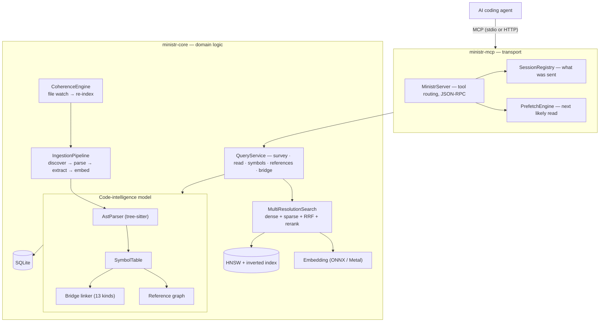
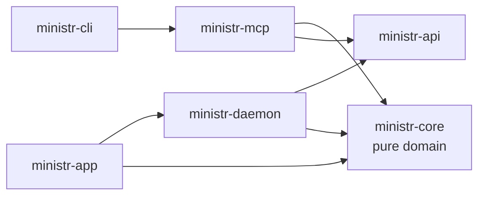

> **ministr** is a Rust-native code intelligence MCP server. It gives AI coding
> agents AST-level understanding of a codebase — semantic search across code and
> docs, symbol-level navigation, real reference graphs, and cross-language bridge
> detection — with session tracking layered on top so the agent's window fills
> with signal instead of redundant re-reads.

This is the long version of the [overview](/docs/architecture). It follows a single arc: how ministr boots, how it turns files into a model, what that model contains, how queries resolve against it, and how session tracking keeps delivery lean.

## The big picture

ministr sits between an agent and a codebase and answers in terms of *structure*, not text. Instead of the agent grepping for a name and reading whole files to find the match, it asks for a symbol, its callers, or its cross-language callers, and gets exactly that.



## Workspace structure

```text
ministr/
├── ministr-cli/              ← Binary entry point, CLI commands
│   └── src/{main.rs, commands/, infra.rs, ingestion.rs, instance.rs, proxy.rs}
│
├── ministr-mcp/              ← MCP adapter (depends on ministr-core + rmcp)
│   └── src/{server/, auth.rs, proxy.rs, error.rs}
│
├── ministr-daemon/           ← HTTP API over a local socket
│   └── src/{daemon.rs, registry.rs, ask.rs, inference.rs, state.rs}
│
├── ministr-api/              ← Shared wire types (no ministr-core dependency)
│   └── src/{query.rs, client.rs}
│
├── ministr-core/             ← Pure domain logic, NO transport dependencies
│   └── src/
│       ├── service/       ← QueryService: the main API facade
│       ├── ingestion/     ← discover → parse → extract → embed
│       ├── code/          ← tree-sitter, symbols, refs, cross-language bridges
│       ├── index/         ← HNSW + inverted index (SPLADE)
│       ├── embedding/     ← ONNX + optional Candle Metal GPU
│       ├── storage/       ← SQLite persistence layer
│       ├── parser/        ← Markdown, HTML, PDF parsers
│       ├── extraction/    ← Claims, relationships, summaries
│       ├── coherence.rs   ← File watcher → incremental re-index
│       └── session/       ← Session tracking + prefetch
│
└── ministr-app/src-tauri/    ← Tauri v2 desktop app with system tray
```

### Dependency rule



`ministr-core` **never** imports MCP types. `ministr-api` never depends on `ministr-core`. The boundaries are enforced structurally, so the code-intelligence engine stays transport-agnostic.

## How it boots up

When you run `ministr serve`:

```text
main()
  ├─ 1. Parse CLI args (clap)
  ├─ 2. Load config (.ministr.toml + ~/.ministr/config.toml)
  ├─ 3. Acquire the PrimaryLock for this corpus
  │     ├─ Acquired → run as PRIMARY (real server)
  │     └─ Held elsewhere → run as a transparent stdio→HTTP proxy
  ├─ 4. init_infrastructure()
  │     ├─ Open/create SQLite (migrate to current schema)
  │     ├─ create_embedder (auto-detects):
  │     │     ├─ Apple Silicon: Candle on Metal (Candle-supported models)
  │     │     ├─ macOS fallback: FastEmbed + CoreML (CPU+GPU)
  │     │     ├─ Windows + `directml`: FastEmbed + DirectML
  │     │     ├─ Linux / plain Windows: FastEmbed + CPU ONNX
  │     │     └─ Override via MINISTR_BACKEND / MINISTR_DEVICE
  │     └─ Load/create HnswIndex (384-dim, cosine)
  ├─ 5. build_server()
  │     ├─ QueryService(storage, embedder, index)
  │     ├─ MinistrServer(service, registry, prefetch, …)
  │     ├─ Enable web fetcher / git fetcher
  │     └─ Spawn coherence file watcher
  └─ 6. Start transport (stdio for Claude Code, or streamable HTTP)
```

## The ingestion pipeline

Before ministr can answer anything it builds the model. Three stages:

- **File discovery** — walk the corpus, filter by extension, hash each file (content + mtime + extractor version) so unchanged files are skipped on re-ingest.
- **Parse & extract** — detect the parser. Markdown / HTML / PDF split into sections with headings. **Code** files parse to a tree-sitter AST, then ministr extracts symbols, resolves references, and links cross-language bridges (the next section).
- **Embed & store** — embed text to a `Vec<f32>`, insert dense vectors into HNSW and sparse terms into the inverted index, pull atomic claims and relationships, write everything to SQLite.

### What gets stored

The content database lives at `~/.ministr/corpora/<corpus-id>/content.db` and is at schema version **21** (`ministr-core/src/storage/schema.rs`, `CURRENT_SCHEMA_VERSION`). Tables group into:

**Corpus content**
- `documents`, `sections`, `claims` — the structural skeleton of every indexed file
- `claim_relationships` — directed edges between claims (references, contradicts, depends_on, updates)
- `file_hashes` — content hash + mtime + extractor version, for incremental re-ingest
- `corpus_roots` — per-root metadata and language stats

**Code intelligence**
- `symbols` — extracted symbols with kind, visibility, signature, doc comment, cyclomatic complexity
- `symbol_refs` — caller→callee, importer→importee, impl→trait edges
- `pending_refs` — deferred reference-resolution queue that survives restarts
- `bridge_endpoints`, `bridge_links` — cross-language binding sites and matched export↔import pairs

**Retrieval acceleration**
- `embedding_cache` — content-addressable vector store, keyed by `(content_hash, model_name)`
- `full_dim_vectors` — un-truncated embeddings for two-stage Matryoshka reranking

**Sessions**
- `sessions`, `session_deliveries` — persisted delivery state so restarts don't drop what the agent already received

**Cross-session learning**
- `section_access_stats`, `co_access_patterns` — frequency / co-access counts feeding cross-session prefetch
- `section_memory_states` — FSRS stability / difficulty / last-access-turn per section

**External fetches**
- `web_cache`, `git_cache` — ETag / commit-SHA bookkeeping for `ministr_fetch` / `ministr_clone` / `ministr_refresh`

**Sub-inference**
- `answer_cache`, `answer_cache_sources` — cached `ministr_ask` answers with a reverse index so one section change invalidates only the affected answers

## The code-intelligence model

This is the part that makes ministr more than RAG-over-code.

### Symbols

Code files route to `ParserKind::Code`. `AstParser` (`ministr-core/src/code/`) initializes tree-sitter with the file's grammar; `walk_top_level_items` traverses the tree and `extract_symbols` produces `Symbol` records carrying name, kind, visibility, module path, full signature, and the attached doc comment. Rust grammar is always compiled in; the default `lang-all` feature adds ~28 more — Python, JS/TS/TSX, Go, Java, C/C++, Ruby, C#, Swift, Kotlin, Bash, PHP, Scala, Lua, Elixir, Haskell, OCaml, Dart, R, HCL/Terraform, SQL, Zig, Protobuf, and the JSON/YAML/TOML config grammars. Grammars without first-class support fall back to `generic_extract_symbols`, which uses node-kind heuristics common across tree-sitter languages, so symbol extraction degrades gracefully rather than failing.

### References

`extract_refs` (`ministr-core/src/code/refs.rs`) walks the AST for raw cross-reference candidates — calls, imports, impl/trait relationships — which are then matched against the symbol table to produce resolved `SymbolRefRecord` edges. Resolution that can't complete in one pass (forward references, cross-file) is queued in `pending_refs` and retried, and that queue is persisted so it survives a restart. First-class reference extraction currently covers 15 languages (Rust, Python, JavaScript, TypeScript/TSX, Go, C, C++, PHP, Kotlin, Scala, Java, C#, Swift, Ruby); others get import-level edges via the generic extractor. `ministr_references` then answers "who calls this / implements this / imports this" from real edges, not a regex.

### Cross-language bridges

The differentiator. A two-pass linker (`ministr-core/src/code/bridge/`):

1. **Extract** endpoints from every source file via per-technology extractors (`#[tauri::command]`, `#[napi]`, `#[pyfunction]`, `#[wasm_bindgen]`, HTTP route attributes, `extern "C"`, cgo `C.func`, JNI `Java_*`, UniFFI, gRPC service defs, Flutter `MethodChannel`, Electron `ipcMain`/`ipcRenderer`).
2. **Link** export↔import pairs by binding key — exact match, then case-normalized, then a semantic fallback — with a confidence score on each link.

`BridgeKind` (`ministr-core/src/code/bridge/mod.rs`) has **13 variants**: `TauriCommand`, `TauriEvent`, `Napi`, `WasmBindgen`, `PyO3`, `HttpRoute`, `Ffi`, `Cgo`, `Jni`, `UniFfi`, `Grpc`, `FlutterChannel`, `ElectronIpc`. Grep sees a Rust function and an unrelated Python function with the same name; `ministr_bridge` sees that the first *is* what the second calls across the boundary.

## The search stack

`ministr_survey` / `ministr_read` ride a hybrid retrieval pipeline:

```text
Text → FastEmbedder (all-MiniLM-L6-v2, ONNX)
           ├─ Dense vector: 384-dim f32 → HNSW (ANN search)
           └─ SPLADE sparse terms → inverted index (keyword-aware)

Query:  dense results ─┐
                       ├─ RRF fusion → candidates → cross-encoder rerank → results
        sparse results ┘
```

Embeddings are cached in SQLite by content hash — unchanged text reuses its vector without re-running ONNX. Optional two-stage Matryoshka reranking pulls full-dimension vectors from `full_dim_vectors` for a precision pass.

### The query path

An end-to-end `ministr_survey` call:

1. **MinistrServer** checks the warm prefetch results.
2. **SessionRegistry** gets or creates the session (keyed by MCP session ID).
3. **QueryService.survey_excluding(query, top_k, delivered_ids)** drops content already sent this session.
4. **MultiResolutionSearch**: embed → HNSW kNN → SPLADE → RRF fusion → optional rerank.
5. **Storage** resolves content IDs to text → `Vec<SurveyResult>`.
6. **SessionRegistry** records the delivery and analytics.
7. **PrefetchEngine** pre-warms predicted next reads.
8. The JSON result is returned to the agent.

Step 3 is the skip-resend filter: `survey_excluding` removes section IDs the session already has, so the agent never pays twice for the same content.

## Content resolution

The `Resolution` enum (`ministr-core/src/types.rs`) has five variants — three for prose, two for code:

- **Summary** — 50–400 token compressed summary (document-level hit, or when explicitly compressed)
- **Section** — full section text with structural context, 200–2000 tokens (default)
- **Claim** — one atomic factual statement, 10–50 tokens (claim-level survey hit, or compressed)
- **SymbolStub** — symbol signature + doc comment, 20–100 tokens
- **SymbolFull** — full source of a symbol, 50–500 tokens

Which one the agent gets depends on the call — `ministr_survey` vs `ministr_read` vs `ministr_definition` — and on whether it asked for compaction.

### Delta delivery

When the agent re-reads a section it already has and the file changed underneath it, ministr computes a diff and ships only that:

```rust
ContentDelta {
    lines: [
        Unchanged("fn login(token: &str) -> Result<User> {"),
        Removed("    let claims = decode_jwt(token)?;"),
        Added("    let claims = verify_jwt(token, &config.secret)?;"),
        Unchanged("    Ok(User::from(claims))"),
    ],
    additions: 1,
    removals: 1,
}
```

Only the changes cross the wire — not the file again.

## Session tracking: the efficiency layer

Code intelligence is the product; session tracking is what keeps it cheap. ministr can't see the agent's real context window (MCP doesn't expose it), so it models its *own output* from the outside.

### What the session holds

The `Session` struct (`ministr-core/src/session/types.rs`) carries the delivery ledger plus bookkeeping. The fields that matter for efficiency:

- **`delivered: BTreeMap<String, DeliveredItem>`** — what's been sent, keyed by content ID
- **`trajectory: VecDeque<ContentId>`** — bounded access order (capped so memory stays flat)
- **`stale: HashSet<String>`** — content invalidated by on-disk changes

`survey_excluding` and the `ministr_read` path consult this so repeats become pointers or deltas.

### The window estimator

`WindowEstimator` (`ministr-core/src/session/window.rs`) keeps an ordered queue of deliveries with token costs and a running total; when the total exceeds the configured size (default `100_000`) it drops oldest entries to estimate what the agent has likely pushed out. The strategy is `Fifo` by default, or `Fsrs` when run with a companion `MemoryTracker`.

> **This estimate is internal accounting.** Earlier builds attached a `budget_status` block to *every* response; that number was anchored to a configured window, not the agent's real context window, and caused agents to wrongly conclude they were almost out of room and abandon work. It is no longer serialized to the agent (`ToolResponse` marks it `#[serde(skip_serializing)]`). The tracker still runs internally so skip-resend and optional compaction keep working, and an agent that genuinely wants the figure can still call `ministr_budget` explicitly.

### The prefetch engine

Six strategies at two moments:

**After every `ministr_read`:** Sequential (next sections in the document), Structural (sibling sections at the same depth), Topical (HNSW query with a running EMA topic vector), Cross-Session (frequently co-accessed sections from analytics — single-process mode today).

**After every `ministr_survey`:** Survey-Expand (parent sections of claim-level hits, so a follow-up read is warm) and Agent-Plan (infer the likely next reads from the query + results, capped so prefetch doesn't waste work).

The topic vector is an exponential moving average — `topic = α·latest + (1−α)·topic`, α≈0.3 — so it drifts while the agent explores and stabilizes as the task narrows, making topical prefetch more accurate over a session.

## The coherence engine

When files change on disk, the model and active sessions both have to update:

1. `notify` detects a filesystem change.
2. `CoherenceEngine` re-parses, re-extracts symbols/refs/claims, re-embeds, updates SQLite and HNSW.
3. `SessionRegistry` marks affected sections stale and queues coherence alerts.

The agent's next tool call carries the pending alerts, and a `ministr_read` on a stale section returns the delta, not the whole file again:

```json
{ "coherence_alerts": ["Section 'src/auth.rs#login' changed since last delivery"] }
```

## How tools map to code

Each MCP tool is an `async fn` on `MinistrServer` (`ministr-mcp/src/server/`). It parses typed params (`SymbolsParams`, `ReferencesParams`, `BridgeParams`, `SurveyParams`, …), delegates to `QueryService` for the real work, shapes the result, and wraps it in a `CallToolResult`. The wrapper carries genuinely actionable signals — coherence alerts, ingestion progress, concrete next-action hints — and deliberately *omits* the window estimate (see the note above).

> A `ministr_task` tool is still registered for backward compatibility (poll a background task). It auto-hides when none of `ministr_fetch` / `ministr_clone` / `ministr_refresh` is enabled, so most users never see it in `tools/list`.

## Why this beats grep + read

| The agent needs to… | grep + read | ministr |
|---|---|---|
| Find a function by name | regex; every textual match, path-prefixed | `ministr_symbols` — the symbol, its kind, signature, docs |
| Know who calls it | regex `\bname\(`, false positives everywhere | `ministr_references` — resolved caller/impl/import edges |
| Follow it across a language boundary | impossible — text can't see FFI | `ministr_bridge` — 13 bridge kinds, export↔import linked |
| Find "where rate limiting lives" | guess keywords, read whole files | `ministr_survey` — hybrid-ranked, exact section |
| Re-check something it already saw | re-reads the whole file | pointer or line-level delta |

## Key design decisions

### Why Rust?

- ONNX inference is CPU-bound — zero-cost abstractions matter
- SQLite + HNSW are memory-mapped — ownership prevents data races
- An always-on background engine must be fast and low-memory
- `tree-sitter` bindings are native C — Rust FFI is zero-overhead
- `tokio` for concurrent I/O without a thread per connection

### Why local embeddings (not an API)?

- **Cost** — zero marginal cost per embedding vs per-token API pricing
- **Privacy** — code never leaves the machine
- **Offline** — works without internet
- **Apple Silicon GPU** — Candle on Metal by default for supported models (typically 7–12× faster than the ONNX path for batch embedding); FastEmbed + CoreML (CPU+GPU) otherwise. The Neural Engine path is intentionally *not* used — the CoreML/ANE bridge has a known ~12 GB/batch leak ([onnxruntime#14455](https://github.com/microsoft/onnxruntime/issues/14455)), so ministr pins CoreML to CPU+GPU compute units
- **Windows DirectML** — with the `directml` feature, FastEmbed runs on any DirectX 12 GPU (NVIDIA / AMD / Intel / Qualcomm) with graceful CPU fallback
