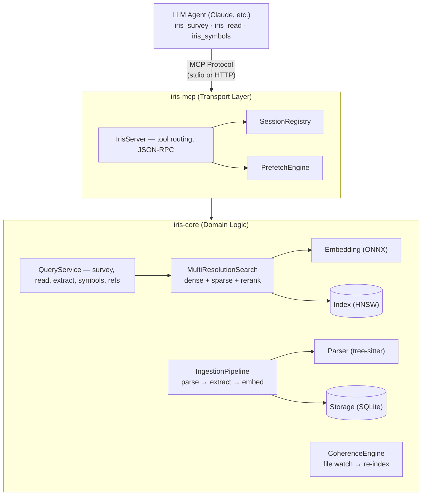
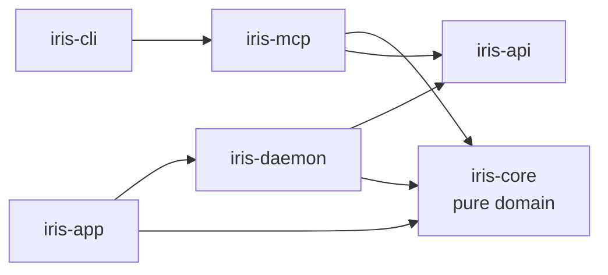

> **iris** is a Rust-native MCP server that serves context to LLM agents the way
> an L1 cache serves the CPU — with session tracking, predictive prefetching,
> budget awareness, and coherence.
>
> iris does not (and can't) edit the agent's context window directly. It manages
> *its own output* — what it sends, when, and at what resolution — so the window
> fills with signal instead of redundant reads.

## The Big Picture

Think of iris as a **smart librarian** that sits between an LLM agent and a codebase. Instead of the agent naively reading files and losing track of what it's already seen, iris indexes everything, tracks what's been delivered, predicts what's needed next, and shapes its own output — resolution, compression, deduplication — so the agent's finite window stays as clear as a well-managed L1 cache.



## Workspace Structure

```text
iris-rs/
├── iris-cli/              ← Binary entry point, CLI commands
│   └── src/
│       ├── main.rs        ← CLI parsing, subcommand dispatch
│       ├── commands/      ← serve, index, init, search, export/import, hooks
│       ├── infra.rs       ← Storage, embedder, index bootstrap
│       ├── ingestion.rs   ← Corpus ingestion orchestration
│       ├── instance.rs    ← Single-instance lock, stdio↔HTTP proxy
│       └── proxy.rs       ← Secondary instance proxy over HTTP
│
├── iris-mcp/              ← MCP server adapter (depends on iris-core + rmcp)
│   └── src/
│       ├── server/        ← IrisServer: tool handlers, session management
│       ├── auth.rs        ← OAuth for cloud deployments
│       ├── proxy.rs       ← Thin proxy that delegates to iris-daemon
│       └── error.rs       ← MCP-specific error types
│
├── iris-daemon/           ← HTTP API over Unix domain socket
│   └── src/
│       ├── daemon.rs      ← Axum server, lifecycle management
│       ├── registry.rs    ← CorpusRegistry: manage multiple corpora
│       ├── ask.rs         ← Query handlers
│       ├── inference.rs   ← Embedding service
│       └── state.rs       ← Shared daemon state
│
├── iris-api/              ← Shared wire types (no iris-core dependency)
│   └── src/
│       ├── query.rs       ← Request/response types
│       └── client.rs      ← DaemonClient for UDS communication
│
├── iris-core/             ← Pure domain logic, NO transport dependencies
│   └── src/
│       ├── service/       ← QueryService: the main API facade
│       ├── ingestion/     ← File discovery → parse → embed pipeline
│       ├── coherence.rs   ← File watcher → incremental re-index
│       ├── session/       ← The "cache controller" brain
│       ├── embedding/     ← ONNX + optional Candle Metal GPU
│       ├── index/         ← HNSW + inverted index (SPLADE)
│       ├── storage/       ← SQLite persistence layer
│       ├── parser/        ← Markdown, HTML, PDF parsers
│       ├── code/          ← tree-sitter, symbols, cross-lang bridges
│       └── extraction/    ← Claims, relationships, summaries
│
└── iris-app/src-tauri/    ← Tauri v2 desktop app with system tray
```

### Dependency Rule



`iris-core` **never** imports MCP types. `iris-api` never depends on `iris-core`. The boundaries are enforced structurally.

## How It Boots Up

When you run `iris serve`, here's the startup sequence:

```text
main()
  │
  ├─ 1. Parse CLI args (clap)
  │
  ├─ 2. Load config (.iris.toml + ~/.iris/config.toml)
  │
  ├─ 3. acquire_role()
  │     ├─ Try to grab a file lock on ~/.iris/corpora/<hash>/iris.lock
  │     ├─ Got it? → You're the PRIMARY (runs the real server)
  │     └─ Locked? → You're a SECONDARY (proxies stdio→HTTP to primary)
  │
  ├─ 4. init_infrastructure()
  │     ├─ Open/create SQLite database
  │     ├─ Load FastEmbedder (ONNX model: all-MiniLM-L6-v2)
  │     │     └─ With CoreML execution provider on Apple Silicon
  │     └─ Load/create HnswIndex (384-dim, cosine similarity)
  │
  ├─ 5. build_server()
  │     ├─ Create QueryService(storage, embedder, index)
  │     ├─ Create IrisServer(service, registry, prefetch, ...)
  │     ├─ Enable web fetcher (for iris_fetch)
  │     ├─ Enable git fetcher (for iris_clone)
  │     └─ Spawn coherence file watcher
  │
  └─ 6. Start transport
        ├─ stdio: MCP over stdin/stdout (default for Claude Code)
        └─ http: Streamable HTTP MCP server (for cloud)
```

## The Ingestion Pipeline

Before iris can answer queries, it needs to index the codebase. The pipeline runs in three stages:

- **File discovery** — walk directory, filter by extension, hash for incremental, skip unchanged files.
- **Parse & split** — detect parser (md / html / pdf / code), parse into sections with headings. For code: tree-sitter AST plus extraction of symbols, references, bridges.
- **Embed & store** — embed text to `Vec<f32>`, insert into HNSW index, extract claims, detect relationships, store in SQLite.

### What Gets Stored

```text
SQLite Database (~/.iris/corpora/<hash>/content.db)
  │
  ├── documents        ─ file path, hash, root kind
  ├── sections         ─ heading path, text, token count, parent
  ├── claims           ─ atomic assertions extracted from sections
  ├── relationships    ─ claim-to-claim connections
  ├── symbols          ─ name, kind, visibility, module, signature, source
  ├── symbol_refs      ─ caller→callee, importer→importee, etc.
  ├── bridge_endpoints ─ cross-language binding sites
  ├── bridge_links     ─ matched export↔import pairs
  ├── embedding_cache  ─ precomputed vectors (keyed by content hash)
  ├── corpus_roots     ─ tracked source directories
  ├── web_sources      ─ fetched URL metadata (ETag, last-modified)
  ├── section_accesses ─ cross-session access frequency
  └── co_accesses      ─ which sections are accessed together
```

### The Embedding Stack

```text
Text → FastEmbedder (all-MiniLM-L6-v2, ONNX Runtime)
           │
           ├─ Dense vector: 384-dim float32
           │     └─ Stored in HNSW index for ANN search
           │
           └─ Optional: SPLADE sparse embedding
                 └─ Stored in inverted index for keyword-aware search

Query time:
  Dense results ─┐
                 ├─ RRF fusion ─→ Candidates ─→ Cross-encoder rerank ─→ Final results
  Sparse results ┘
```

The embeddings are cached in SQLite keyed by content hash — if the text hasn't changed, the embedding is reused without re-running ONNX inference.

## The Query Path

When the agent calls `iris_survey`, the flow end-to-end is:

1. **IrisServer** checks the warm prefetch cache.
2. **SessionRegistry** gets or creates the session (keyed by MCP session ID).
3. **QueryService.survey_excluding(query, top_k, delivered_ids)** excludes already-delivered content.
4. **MultiResolutionSearch**: embed → HNSW kNN → optional SPLADE → RRF fusion → optional rerank.
5. **Storage** resolves content IDs to text, returning `Vec<SurveyResult>`.
6. **SessionRegistry** records delivery + budget + analytics.
7. **PrefetchEngine** pre-warms predicted next reads.
8. JSON response + `budget_status` returned to the agent.

### Deduplication

The `survey_excluding` call filters out section IDs that the session has already delivered. This prevents the agent from getting the same content twice. The session shadow tracks everything:

```rust
Session {
    delivered: BTreeMap<ContentId, DeliveredItem>,  // what's been sent
    trajectory: Vec<ContentId>,                      // access order
    stale: HashSet<ContentId>,                       // invalidated by file changes
}
```

## The Session Shadow: iris's "Cache Controller" Brain

This is the most novel subsystem. It models the agent's context window **from the outside**, predicting what the agent has retained and what's been evicted.

### The Window Estimator

```text
WindowEstimator {
    capacity: 100_000 tokens,
    policy: FIFO,
    entries: VecDeque<(content_id, token_count)>,
    current_tokens: 47_320,
    evicted: ["old-section-1", "old-section-2", ...]
}

When new content is delivered:
  1. Add entry to back of queue
  2. current_tokens += new_tokens
  3. While current_tokens > capacity:
     │  Pop from front (FIFO)
     │  current_tokens -= popped.tokens
     └  Move to evicted list
```

### Budget Pressure Levels

The budget tracker maps window utilization to three pressure levels:

- **Normal** (0-80%) — full section text at requested resolution
- **Elevated** (80-95%) — claim-level compression + eviction recommendations
- **Critical** (95-100%) — summaries only, strong eviction recommendations

This is included in **every response** as `budget_status`:

```json
{
  "budget_status": {
    "pressure_level": "normal",
    "tokens_used": 4112,
    "tokens_remaining": 95888,
    "utilization": 0.041
  }
}
```

## The Prefetch Engine

After each `iris_read`, the prefetch engine speculatively pre-warms sections the agent is likely to request next. Five strategies:

1. **Sequential** (cache line prefetch) — pre-warm section N+1, N+2 in same document
2. **Topical** (branch prediction) — query HNSW with running EMA topic vector
3. **Structural** (spatial locality) — pre-warm sibling sections at same depth
4. **Cross-Session** (shared cache) — pre-warm frequently co-accessed sections
5. **Survey Expand** (TLB prefetch) — pre-warm parent sections of claim hits

### The Topic Tracker

The topical prefetch strategy maintains a running "topic vector" using exponential moving average (EMA):

```text
topic_vector = alpha * latest_embedding + (1 - alpha) * topic_vector

  alpha = 0.3 (configurable)

  Early in session: topic drifts quickly as agent explores
  Later: topic stabilizes, prefetch becomes more accurate
```

## The Coherence Engine

When files change on disk, iris needs to update the index AND notify active sessions.

Flow:
1. `notify` crate detects a file-system change.
2. `CoherenceEngine` re-parses, re-extracts claims, re-embeds, updates SQLite, updates HNSW.
3. `SessionRegistry` marks affected sections stale and queues coherence alerts.

When the agent next calls any iris tool, it receives pending alerts:

```json
{
  "coherence_alerts": [
    "Section 'src/auth.rs#login' has been modified since last delivery"
  ]
}
```

And `iris_read` on a stale section delivers only the **delta** (what changed), not the full text again.

## Content Resolution

iris indexes content at multiple granularity levels and delivers at the appropriate resolution based on context budget pressure:

- **Document** — "Here's the entire file"
- **Section** — "Here's the #login function section" (default)
- **Claim** — "login() validates JWT tokens and returns a User struct" (elevated pressure)
- **Summary** — "Auth module: handles JWT validation, session management" (critical pressure)

### Delta Delivery

When the agent re-reads a section it already has, iris computes a diff:

```rust
ContentDelta {
    lines: [
        Unchanged("fn login(token: &str) -> Result<User> {"),
        Removed("    let claims = decode_jwt(token)?;"),
        Added("    let claims = verify_jwt(token, &config.secret)?;"),
        Unchanged("    Ok(User::from(claims))"),
    ],
    additions: 1,
    removals: 1,
}
```

This saves massive amounts of context window space — only the changes are delivered.

## Code Intelligence

iris doesn't just search text. It builds a rich code model via tree-sitter:

- **Symbols** — structs, fns, traits, enums, impls — with name, kind, visibility, module, signature, docs
- **References** — callers, callees, implementors, importers
- **Language refinements** — per-language post-processing: Rust, TypeScript, Python, Go, Java, C, C++, Swift, Kotlin

### Cross-Language Bridges

iris detects and links cross-language bindings via a two-pass pipeline:

1. **Extract** endpoints from all source files (`#[napi]`, `#[pyfunction]`, `#[tauri::command]`, `#[wasm_bindgen]`, HTTP route attributes)
2. **Link** export↔import pairs by binding key (exact match → case-normalized → semantic fallback)

Supported bridges: napi-rs, PyO3, Tauri commands, wasm-bindgen, HTTP routes.

## The MCP Server: How Tools Map to Code

Each iris MCP tool maps to a method chain:

| MCP Tool | `IrisServer` method | `QueryService` method |
|---|---|---|
| `iris_survey` | `handle_survey()` | `survey_excluding()` |
| `iris_read` | `handle_read()` | `read_section()` |
| `iris_extract` | `handle_extract()` | `extract_claims()` |
| `iris_symbols` | `handle_symbols()` | `search_symbols()` |
| `iris_definition` | `handle_definition()` | `symbol_definition()` |
| `iris_references` | `handle_references()` | `symbol_references()` |
| `iris_toc` | `handle_toc()` | `table_of_contents()` |
| `iris_budget` | `handle_budget()` | *(session state only)* |
| `iris_compress` | `handle_compress()` | `compress_for_eviction()` |
| `iris_evicted` | `handle_evicted()` | *(session state only)* |
| `iris_fetch` | `handle_fetch()` | `WebFetcher` + ingest |
| `iris_clone` | `handle_clone()` | `GitFetcher` + ingest |
| `iris_refresh` | `handle_refresh()` | `WebFetcher` staleness check |
| `iris_bridge` | `handle_bridge()` | `search_bridge_links()` |
| `iris_related` | `handle_related()` | `related_claims()` |

Every response wraps the result data with `budget_status`, so the agent always knows how much context budget it has remaining.

## Key Design Decisions

### Why "Like a CPU Cache"?

| CPU Cache Concept | iris Equivalent |
|---|---|
| Cache line | Section (a heading-delimited chunk of content) |
| L1/L2/L3 hierarchy | Claim → Section → Document resolution levels |
| Cache hit | Content already in session → skip/delta delivery |
| Cache miss | Cold read → full retrieval from storage + embedding |
| Prefetch | Speculative pre-warming of predicted next reads |
| Write-back | Coherence engine: file changes → re-index + alerts |
| Cache coherence | Session stale marking across concurrent sessions |
| Eviction (LRU/FIFO) | Window estimator evicts oldest delivered content |
| Cache pressure | Budget pressure levels (Normal/Elevated/Critical) |

### Why Rust?

- ONNX inference is CPU-bound — zero-cost abstractions matter
- SQLite + HNSW are memory-mapped — Rust's ownership model prevents data races
- MCP server needs to be fast and low-memory for always-on background service
- `tree-sitter` bindings are native C — Rust FFI is zero-overhead
- `tokio` async runtime for concurrent I/O without threads per connection

### Why Local Embeddings (not API)?

- **Cost** — zero marginal cost per embedding vs per-token API pricing
- **Privacy** — code never leaves the machine
- **Offline** — works without internet
- **CoreML** — Apple Neural Engine acceleration on Apple Silicon
