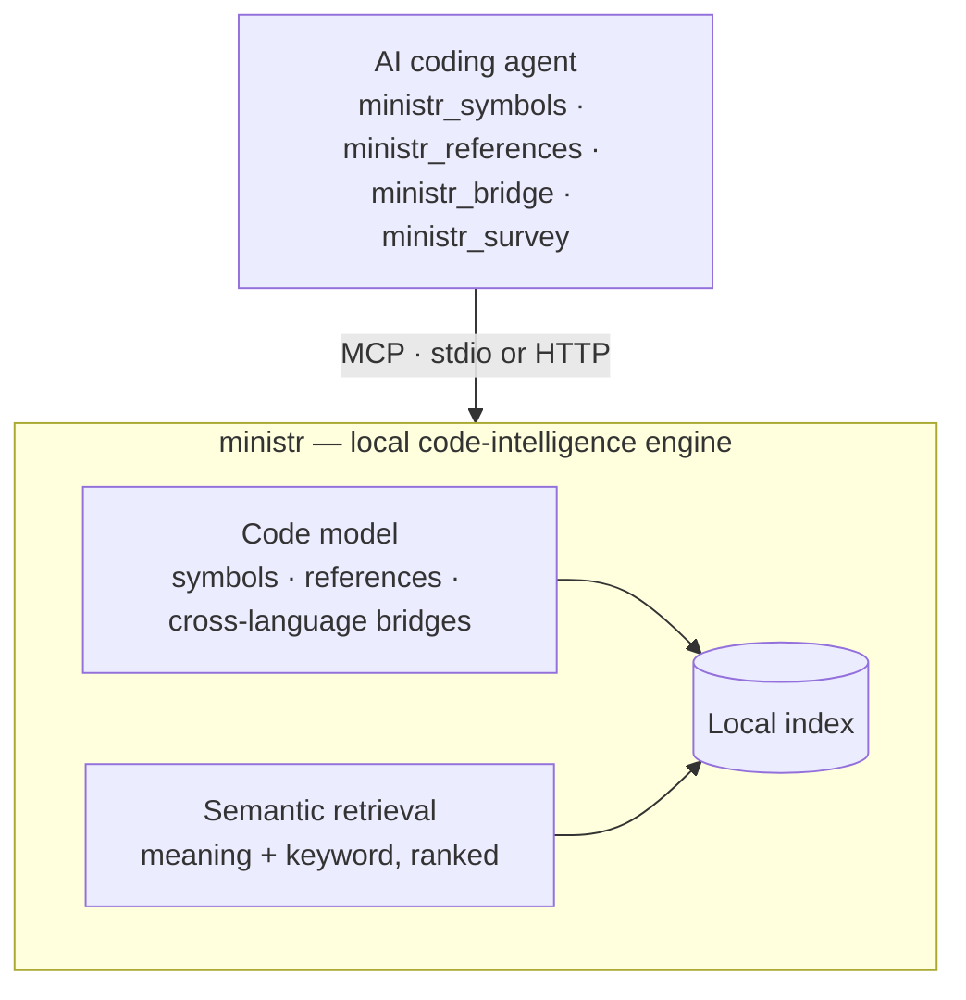

ministr is a code intelligence MCP server. It turns a repository into a queryable model — symbols, references, cross-language bridges, and meaning-ranked text — and serves that model to an AI coding agent over MCP. This page is the conceptual shape of the thing; it is intentionally a black-box overview, not an implementation tour.

## The shape of it

The agent never works with raw files. It works with the model: ask for a symbol, its callers, what calls it across a language boundary, or "where is rate limiting handled" — and ministr resolves each against a local index, returning the exact slice rather than a file dump. Everything runs on your machine.

## Two query surfaces

The model exposes two surfaces that compose:

- **Structural** — `ministr_symbols`, `ministr_definition`, `ministr_references`, `ministr_bridge`. ministr parses code into an abstract syntax tree, so it answers in terms of real program structure: a symbol's kind and signature, its actual callers and implementors, and cross-language bindings linked across **13 bridge kinds** (Tauri, napi-rs, PyO3, wasm-bindgen, gRPC, HTTP, FFI, and more). A regex can't tell a definition from a mention, or that a Rust export is what some Python file calls across the boundary; this surface can.
- **Semantic** — `ministr_survey`, `ministr_read`, `ministr_extract`. Meaning-based search fused with keyword matching and ranked, with every document available at several resolutions so the agent gets the right granularity — a summary, a section, a single fact, or a symbol — instead of a whole file.

## Local by default

ministr indexes, embeds, and searches entirely on the local machine — no code is sent to any API. Parsing covers **40+ languages**; the only outbound calls happen when you explicitly ask a fetch or clone tool to pull an external source. The model lives in a local index directory; nothing about it leaves the machine.

A background engine builds and holds that model once and shares it, so multiple MCP clients (and the desktop app) query the same index instead of each loading their own copy into memory. To an MCP client this is invisible — it speaks ordinary MCP over stdio or HTTP and gets answers.

## Where to go next

- [Core concepts](/docs/concepts) — symbols, references, cross-language bridges, and hybrid search, in plain terms.
- [Tool reference](/docs/tools) — every MCP tool ministr exposes, with parameters and examples.
- [Getting started](/docs/getting-started) — install, index a project, and connect your agent.
