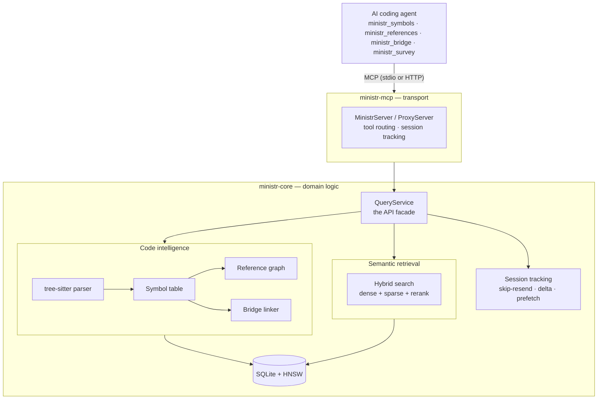

ministr is a code intelligence MCP server. Its job is to turn a repository into a queryable model — symbols, references, cross-language bridges, and meaning-ranked text — and serve that model to an AI coding agent over MCP. This page is the map: how the crates fit together, how code becomes that model, and where it all lives on disk. For the step-by-step walkthrough see the [deep dive](/docs/architecture-deep-dive); for the runtime topology see [Daemon & Tray](/docs/architecture-daemon).

## The shape of it



The agent never sees files. It sees the model: ask `ministr_symbols` for a function, `ministr_references` for its callers, `ministr_bridge` for what calls it across a language boundary, `ministr_survey` for "where is rate limiting handled" — and ministr resolves each against the indexed AST and vector store, returning the exact slice rather than a file dump.

## Workspace structure

ministr is a Cargo workspace of six crates with a strict dependency direction:

```text
ministr-core/          — domain logic: parsing, code intelligence, search, sessions. No transport deps.
ministr-api/           — pure wire types + DaemonClient. No dependency on ministr-core.
ministr-daemon/        — long-running engine: HTTP over a local socket, owns model + indexes.
ministr-mcp/           — MCP adapter (rmcp): tool handlers, routing, response shaping.
ministr-cli/            — binary entry point: arg parsing, config, transport startup.
ministr-app/src-tauri/ — Tauri v2 desktop app: dashboard + system tray over the daemon.
```

- **ministr-core** is where the intelligence lives — tree-sitter parsing, symbol/reference extraction, the cross-language bridge linker, hybrid search, and session tracking. It knows nothing about MCP or any transport.
- **ministr-api** is pure types plus `DaemonClient`, the client that talks to the daemon over `~/.ministr/ministrd.sock`. It deliberately does *not* depend on ministr-core, so the boundary is enforced by the compiler.
- **ministr-daemon** is the always-on engine that owns the heavy resources (ONNX model, HNSW indexes, SQLite) and exposes them over a local socket so multiple clients share one process.
- **ministr-mcp** adapts `QueryService` to MCP. It ships in two flavours: a standalone `MinistrServer` that owns its own storage/index, and a `ProxyServer` that forwards to the daemon so a second agent doesn't load a second copy of the model into RAM.
- **ministr-cli** parses arguments, loads config, and starts the MCP server over stdio (Claude Code) or streamable HTTP (remote).
- **ministr-app** wraps the daemon in a desktop GUI and tray icon.

## How code becomes a model

Indexing runs in three stages; the middle one is what separates ministr from grep:

1. **Discover** — walk the corpus, filter by extension, hash each file so unchanged files are skipped on re-ingest.
2. **Parse & extract** — route each file to a parser (Markdown / HTML / PDF / **code**). Code files go through tree-sitter into an AST, then ministr extracts **symbols** (kind, visibility, signature, doc comment, complexity), resolves **references** (caller→callee, impl→trait, importer→importee), and runs the **bridge linker** to match cross-language exports to their callers.
3. **Embed & store** — embed text locally (ONNX), insert dense vectors into HNSW and sparse terms into the inverted index, pull atomic claims and relationships, and persist everything to SQLite.

The result is a model with two query surfaces that compose:

- **Structural** — `ministr_symbols`, `ministr_definition`, `ministr_references`, `ministr_bridge`. Backed by the symbol table, reference graph, and bridge links. Knows that a function has three callers and that a Rust `#[pyfunction]` is what Python imports across the boundary — things text search cannot answer.
- **Semantic** — `ministr_survey`, `ministr_read`, `ministr_extract`. Backed by hybrid retrieval: dense embeddings (HNSW) fused with sparse keyword matching (SPLADE) via reciprocal-rank fusion, then reranked. Every document is indexed at multiple resolutions — summary, section, claim, symbol stub, full source — so the agent gets the granularity it asked for, not a whole file.

Sitting underneath both surfaces is **session tracking**: ministr records what it has already sent each session, so a repeat request returns a pointer or just the changed lines, and predictive prefetch warms the next likely lookup. This is an efficiency layer, not the headline — see the deep dive's [session tracking](/docs/architecture-deep-dive#session-tracking-the-efficiency-layer) section.

## On-disk layout

```text
~/.ministr/
├── config.toml                       # Global configuration
├── corpora.json                      # Daemon's registered-corpus manifest
├── ministrd.sock                     # Daemon socket (UDS on macOS/Linux; named pipe on Windows)
├── ministrd.pid                      # Daemon PID file
└── corpora/
    └── <corpus-id>/                  # Stable hash derived from corpus paths
        ├── meta.toml                 # Per-corpus config (name, model, watch flag, …)
        ├── content.db                # SQLite: documents, sections, claims, symbols,
        │                             #   symbol_refs, bridge_endpoints/links, sessions
        ├── sessions/                 # Persisted session state
        └── index/
            ├── ministr_hnsw.hnsw.data  # HNSW vector dump
            ├── ministr_hnsw.hnsw.graph
            └── id_map.json           # Section ID ↔ vector slot mapping
```

The single `content.db` holds both the prose skeleton (documents / sections / claims) and the code-intelligence model (`symbols`, `symbol_refs`, `bridge_endpoints`, `bridge_links`), so a structural query and a semantic query hit the same store. Schema and table-by-table breakdown are in the [deep dive](/docs/architecture-deep-dive#what-gets-stored).

## Key dependencies

| Purpose | Crate |
|---|---|
| Code parsing | `tree-sitter` (~29 language grammars) |
| Embeddings | `fastembed` (ONNX, local) / `candle` (Metal GPU on Apple Silicon) |
| Vector search | HNSW index (in-memory, memory-mapped) |
| Storage | `rusqlite` (SQLite) |
| MCP protocol | `rmcp` |
| Document parsing | `comrak` (Markdown), `scraper` (HTML), `pdf-extract` (PDF) |
| Async runtime | `tokio` |
| File watching | `notify` |
| Observability | `tracing` |
