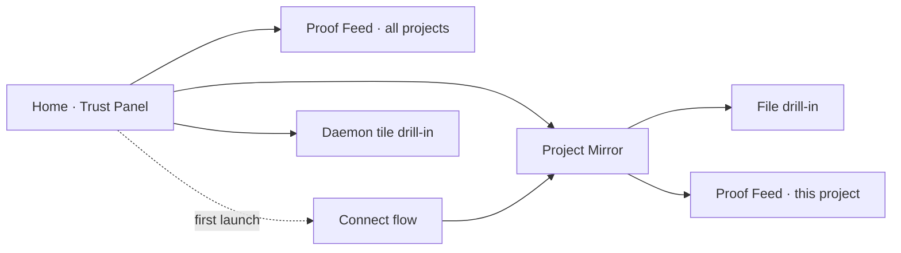

# ministr GUI — UX Blueprint

**Version:** v4 · 2026-06-11 · **Status:** ACCEPTED (v4, 2026-06-11)
**This is a STRUCTURAL SKETCH, not visual design.** Boxes are object
placements, not pixels. No colors, no type, no tokens here.

**Banned incumbent composition:** "A facet-tab workspace — app bar + scope
header + Ask/Explore/Activity/Tend tabs, each a full-screen surface, with an
entity-inspector drawer." No screen below may be that shape.

---

## 1 · Interview record

**Round 1 (soul):**
- *Primary verb:* (user's own words) "configuration and management of the
  indexes' health and watching stuff live, basic — no need for controls" +
  "imagine how this MCP server would exist in an ecosystem with Keelnote"
  (think-and-ship's commercial dashboard owns reasoning/execution; this GUI
  owns code-intelligence only).
- *User:* Beta devs (expert strangers) — **amended mid-session:** "also think
  about the beginner who's just vibe coding."
- *Feel:* Mission control.
- *References:* Observability-done-right · Flight-ops/ATC.

**Round 2 (direction):** First concept set rejected with the load-bearing
note: *"do I care about vector count as a non-technical vibe coder?"* +
*"[they] want a tool that they can trust gives their AI better intelligence
of their codebase."* → re-diverged to trust-first concepts.

**Round 2′ (trust-first):**
- *Paradigm:* **B — Agent's-Eye View** (the screen shows what the AI
  currently sees; the file tree IS the trust display).
- *Secondary surface:* losing concepts become drill-ins.
- *Config home:* inside each object — no settings page.

## 2 · The thesis

The GUI answers one question a vibe coder actually has: **"is my AI seeing
my code properly — and is this thing making it smarter?"** The core screen
is a live mirror of the agent's view of the repo: every file annotated with
whether the AI sees the *current* version, anything changed-but-unindexed
flagged as *invisible to your AI yet*, and a live presence line showing what
the AI is reading right now. Trust is per-file, verifiable, and never
abstract. All internals (vectors, embeddings, HNSW, claim extraction) exist
only behind drill-ins for the expert. Grounding: the daemon already streams
per-session turn events and per-corpus freshness over UDS
(`GET /api/v1/sessions`, session registry turn stream, watcher state) — the
telemetry exists; this structure finally makes it legible.

Ecosystem boundary: Keelnote (think-and-ship) owns *what the agent thought
and shipped*. This GUI owns *what the agent could see and retrieve*. No
task management, no reasoning traces here.

## 3 · The screens

### 3.1 Home — the Trust Panel (entry screen)

One line per project. The whole app at a glance; nothing technical.

```
┌──────────────────────────────────────────────────────────────┐
│ ministr                                          ⌘K · ● ok   │
├──────────────────────────────────────────────────────────────┤
│  my-app                                                      │
│  ● YOUR AI SEES YOUR CODE — UP TO DATE                       │
│    last change picked up 40 seconds ago · 1 agent reading    │
│                                                              │
│  side-project                                                │
│  ⚠ YOUR AI IS 3 SAVES BEHIND               [ Catch up ~40s ] │
│    it may answer from old code (mostly login.tsx)            │
│                                                              │
│  + Add a project                                             │
├──────────────────────────────────────────────────────────────┤
│ LIVE · 10:42 my-app: AI searched “login button” → found      │
│        LoginForm.tsx · 10:43 reading handleSubmit()          │
└──────────────────────────────────────────────────────────────┘
```

- Click a project → **Project Mirror** (3.2). Click the LIVE strip → the
  **Proof Feed** (3.3).
- Healthy projects are quiet; a degraded project's row comes forward
  (mission-control exception ordering: worst first).

### 3.2 Project Mirror — the core screen (Agent's-Eye View)

```
┌──────────────────────────────────────────────────────────────┐
│ ‹ my-app · what your AI sees             snapshot: 2m ago    │
├───────────────────────────────────────────────┬──────────────┤
│  src/                                         │ THIS PROJECT │
│   ● components/LoginForm.tsx   current ✓      │ watching ✓   │
│   ● components/Navbar.tsx      current ✓      │ auto-update  │
│   ⚠ lib/auth.ts   you changed this 5 min ago  │   on save ✓  │
│     → your AI still sees the OLD version      │ ignores:     │
│       [ Update now ]                          │  node_modules│
│   ● pages/index.tsx            current ✓      │  .env ✓      │
│   ✗ secrets.json    hidden from your AI       │ language     │
│     (you excluded it)                         │  model: auto │
│                                               │ [+ advanced] │
├───────────────────────────────────────────────┴──────────────┤
│ ● your AI is reading LoginForm.tsx right now                 │
│   before that: searched “login button” → 3 strong matches    │
└──────────────────────────────────────────────────────────────┘
```

- **The tree is the trust display.** Per-file truth: `current ✓` /
  `old version ⚠ (changed Nm ago)` / `hidden ✗ (excluded)` /
  `updating… ◌` (live during re-index).
- **Right rail = this project's config**, inline (config-where-you-look):
  watch toggle, ignore list, advanced disclosure for the expert (model,
  chunking — the only place internals appear).
- **Presence line**: what the AI is reading *now*, from the live session
  turn stream. Read-only; no agent controls (Keelnote's lane).
- Click a file → **File drill-in**: the file as the AI sees it (its
  sections/symbols, when an agent last read it, side-by-side
  yours-vs-AI's-version when stale).

### 3.3 Proof Feed — the trust-evidence engine (per project or per agent)

**Reframed in v3.** The feed doesn't just narrate events — it links
retrieval to *outcomes* and continuously re-derives why you trust this
thing. Two measured stats anchor it, both computable from existing
telemetry (tool-call stream + code-touched symbols + working-tree diff):

- **First-touch accuracy** — was the AI's first meaningful read the file
  it ended up editing? Per task, then aggregated ("right on the first
  read in 8 of 9 tasks today").
- **Wander length** — retrieval calls before the AI touched the thing it
  changed. Lower = the trust feeling, quantified.

The hero receipt is outcome-linked and fires when a session's edits land:

```
│ ✓ 10:58  task done: your AI's FIRST read (LoginForm.tsx)  │
│          was the file it edited · 1 search, no wandering  │
```

Honesty cuts both ways — wandering shows too ("read 6 files before
finding it"), which is diagnostic, not shameful.


```
┌──────────────────────────────────────────────────────────────┐
│ ‹ my-app · what ministr did for your AI        ● all good    │
├──────────────────────────────────────────────────────────────┤
│ 10:43  your AI asked about “login button”                    │
│        → sent straight to LoginForm.tsx (1 search)           │
│ 10:41  your AI needed handleSubmit()                         │
│        → exact definition + its 3 callers                    │
│ ⚠ 10:39 you changed lib/auth.ts — your AI read the old       │
│        version at 10:40                       [ Catch up ]   │
│ ──────────────────────────────────────────────────────────── │
│ today: 47 questions answered · 41 from memory (fast)         │
│ ▸ expert view: raw tool calls, scores, tokens, cache         │
└──────────────────────────────────────────────────────────────┘
```

- Receipts are **only real events restated** (tool call + result count +
  target). No invented "time saved" claims unless measured (honest-data
  rule; the retracted-benchmark lesson applies here).
- `expert view` discloses the raw ledger (tool, latency, score, tokens,
  cache hit) — the old Activity surface's density, one level down.

### 3.4 First-run — connect flow (the beginner's first 5 minutes)

Linear, three beats, reusing the boot-medallion vocabulary:

```
[1 Pick your project folder] → [2 ministr reads your code
 (live progress, plain words: “reading 1,482 files…”)] →
[3 Connect your AI — pick Claude Code / Cursor / Windsurf →
 one copy-paste → waits → “● your AI just saw your code for
 the first time” (fires on the first real tool call)]
```

The step-3 confirmation is the product's trust handshake: it only fires on
a genuine MCP tool call arriving.

### Navigation shape



Hub-and-spoke, two levels deep, no tabs. The daemon (memory, version,
restart) is one quiet tile on Home, expanding in place.

## 4 · Object → component contract

| Domain object | Canonical component | Appears |
|---|---|---|
| Corpus/project | TrustRow (compact) / ProjectMirror (full) | Home / core screen |
| File (indexed doc) | TrustTreeRow (compact) / FileMirror (full) | Mirror tree / drill-in |
| Freshness gap (watcher vs index) | StalenessFlag + CatchUpAction | TrustRow, TrustTreeRow, Proof Feed |
| Session (agent) | PresenceLine (compact) / AgentReceipts (full) | Mirror footer / Proof Feed |
| ToolCall/Turn | Receipt (plain) / LedgerRow (expert) | Proof Feed |
| Index job | ProgressBeat ("reading your code…") | Connect flow, CatchUp |
| Daemon | DaemonTile | Home corner |
| Exclusion rule | HiddenMark + ignore-list editor | Mirror tree + right rail |

## 5 · Invariants made structural

1. **The tree never lies.** `current ✓` requires content-hash equality
   between working tree and index — not timestamps. (Needs the watcher
   gap fixed: roadmap `f-watcher-pathset-staleness`.)
2. **Presence is real.** "Your AI is reading X" renders only from actual
   session turn events; no event, no presence line.
3. **Receipts restate, never embellish.** Every Proof Feed line maps 1:1
   to a recorded tool call; aggregate claims only from measured values.
4. **Internals live one level down.** No vector/embedding/token vocabulary
   on Home or the Mirror's default state; the `advanced`/`expert`
   disclosures are the single doorway.
5. **No agent control.** Read-only over sessions (kill/steer is out of
   scope; reasoning/tasks belong to Keelnote).
6. **Excluded means invisible everywhere.** A `✗ hidden` file can never
   appear in presence lines or receipts (it can't be retrieved).

## 6 · What this costs (honest)

1. **Per-file freshness needs real plumbing**: content-hash diff between
   watcher state and index, exposed over UDS per file — today freshness is
   corpus-grained; `f-watcher-pathset-staleness` is open and load-bearing.
2. **The live mirror needs an event stream**, not polling, for presence to
   feel "live" (<1s); the daemon's turn stream exists but the app polls.
3. **Plain-language receipts are a writing problem**: each tool needs a
   human sentence template that stays honest ("3 strong matches" needs a
   score threshold definition).
4. **Big repos stress the tree**: 10k+ file mirrors need virtualization +
   roll-up states per directory (worst-state-wins propagation).
5. **The old facets' power-user value** (Ask, Explore-as-search,
   constellation viz) is deliberately demoted or cut at top level; experts
   may miss it — mitigated by ⌘K and expert disclosures, but it's a bet.

## 7 · Rejected directions

- **v0 concept set (Mission Wall / Pipeline / Field Report)** — rejected by
  user note: "do I care about vector count as a non-technical vibe coder?"
  → reframed around trust, not instrumentation.
- **Trust Panel as the whole app** — kept, but demoted to the Home screen.
- **Proof Feed as the whole app** — kept as the activity drill-in.
- **Strict single paradigm / always-on briefing strip** — user chose
  losing-concepts-as-drill-ins instead.
- **Classic settings surface / setup-wizard option** — config lives inside
  each object; first-run connect flow retained as an entry path (not a
  settings area).
- **Incumbent facet-tab workspace** — banned at session start.

**v3 → v4 (refinement round 3 — ACCEPTED):**
- **Verdict timing: live, as edits land.** The read→edit link receipt
  fires the moment a previously-read file is edited (premature-verdict
  risk accepted for liveness).
- **Home headline: freshness first.** Trust stat is the quiet second line.
- **Bad evidence: equal-weight receipts.** Wander receipts render exactly
  like wins, neutrally worded — symmetric honesty is the product's
  credibility (invariant 3 extended: the feed never curates).

**v2 → v3 (refinement round 2):** Proof Feed reframed from event narration
to a **trust-evidence engine** — receipts link retrieval to session
outcomes; first-touch accuracy + wander length become the two measured,
auditable stats. Driven by the user's product question: "I trust my AI
more with this but can't qualify why anymore" — the GUI's job is to
re-qualify it, per user, on their own repo. New domain object:
**SessionOutcome** (join of first-reads × edited files).

**v1 → v2 (refinement round 1):**
- **Ask is CUT entirely** (user decision): asking is the agent's job; the
  GUI is a pure mirror/trust instrument. No ⌘K answer mode, no trust-probe
  panel. ⌘K remains navigation-only.
- **Value claims = counts only** (user decision): the Proof Feed restates
  measured event counts; no latency-fact lines, no comparative time-saved
  claims anywhere (invariant 3 hardened accordingly).
